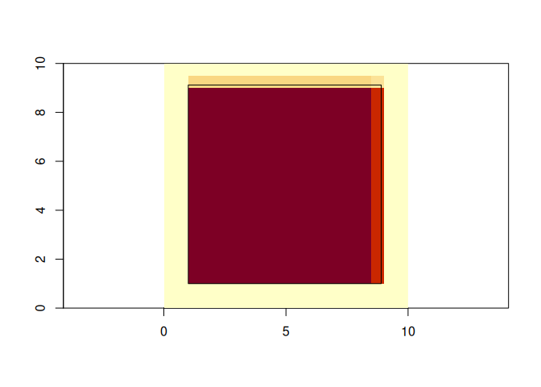

<!-- README.md is generated from README.Rmd. Please edit that file -->

# controlledburn

<!-- badges: start -->

[](https://github.com/hypertidy/controlledburn/actions/workflows/R-CMD-check-check.yaml)
<!-- badges: end -->

Rasterize geometry without materializing any pixel values.
controlledburn produces sparse tables for polygon, line, and point input
— one type-pure table per geometry kind.

Two modes: **coverage** (exact analytical coverage fractions via
vendored exactextract math) and **approx** (cell-centre rule, fasterize
semantics, runs only). Both are O(perimeter) in time and memory; no
dense matrix is allocated.

Dependencies: `cpp11`, `wk`. No GEOS, no sf, no Armadillo.

## Installation

``` r
remotes::install_github("hypertidy/controlledburn")
```

## Usage

``` r
library(controlledburn)
library(geos)

poly <- as_geos_geometry("POLYGON ((1 1, 8.9 1, 8.9 9.12, 1 9.12, 1 1))")

# Coverage mode (default): exact boundary fractions
r <- burn(poly, extent = c(0, 10, 0, 10), dimension = c(20L, 20L))
r
#> <controlledburn> 20 x 20 grid, 1 geometry
#>   runs:   45 (240 interior cells)
#>   edges:  32 polygon boundary cells
#>   sparsity: 32.0% empty

# Approx mode: cell-centre rule, runs only, no edges
r_approx <- burn(poly, extent = c(0, 10, 0, 10), dimension = c(20L, 20L),
                 mode = "approx")
r_approx
#> <controlledburn> 20 x 20 grid, 1 geometry
#>   runs:   16 (256 interior cells)
#>   edges:  0 polygon boundary cells
#>   sparsity: 36.0% empty

# Materialize only when you need it
mat <- materialize_chunk(r)
ximage::ximage(mat, extent = c(0, 10, 0, 10), asp = 1)
plot(poly, add = TRUE)
```



``` r
unique(c(mat))
#> [1] 0.000 0.240 1.000 0.192 0.800
## no variation in the approx mode
unique(c(materialise_chunk(r_approx)))
#> [1] 0 1
```

### Default grid parameters

With no extent or dimension, controlledburn derives both from the
geometry:

``` r
r <- burn(poly)
# extent from wk::wk_bbox(), 256 cells on the long axis
```

Or specify resolution:

``` r
r <- burn(poly, resolution = 0.5)
```

### Lines and points

Lines produce a `$lines` table with absolute length within each cell (in
CRS units, not a fraction):

``` r
line <- as_geos_geometry("LINESTRING (0 5, 10 5)")
r <- burn(line, extent = c(0, 10, 0, 10), dimension = c(20L, 20L))
head(r$lines)
#>   row col length id
#> 1  11   1    0.5  1
#> 2  11   2    0.5  1
#> 3  11   3    0.5  1
#> 4  11   4    0.5  1
#> 5  11   5    0.5  1
#> 6  11   6    0.5  1
```

Points produce a `$points` table with one record per cell hit (no
measure column — a point is either in a cell or it isn’t):

``` r
pts <- as_geos_geometry(c("POINT (2 3)", "POINT (7 8)"))
r <- burn(pts, extent = c(0, 10, 0, 10), dimension = c(20L, 20L))
r$points
#>   row col id
#> 1  15   5  1
#> 2   5  15  2
```

### Geometry input

`burn()` accepts `geos_geometry`, `sfc` (sf), `wk::wkb()`, `blob`, or a
list of raw WKB vectors. The raw-WKB path is compatible with
`vapour::vapour_read_geometry()` and `gdalraster::GDALVector` output.

controlledburn rasterizes whatever geometry it’s given.
Self-intersecting rings, unclosed polygons, repeated vertices,
near-degenerate inputs — all go through the same fast path. If your
input has topological issues that matter for your science, you’ll see it
in the output and can decide what to do. If they don’t matter, you’ve
saved the cost of validating them. Either way the package trusts your
judgement on what valid means in context. For when you do want to check
or repair, `geos::geos_is_valid()` and `geos::geos_make_valid()` are
perfectly suitable.

### Shared boundary complementarity

Adjacent polygons with shared edges produce complementary coverage
fractions that sum to exactly 1.0 in every boundary cell — no gaps, no
overlaps:

``` r
left  <- as_geos_geometry("POLYGON ((0 0, 5 0, 5 10, 0 10, 0 0))")
right <- as_geos_geometry("POLYGON ((5 0, 10 0, 10 10, 5 10, 5 0))")

r <- burn(c(left, right), extent = c(0, 10, 0, 10), dimension = c(20L, 20L))

# Coverage sums to 1.0 in every touched cell
mat <- materialize_chunk(r)
max(mat)
#> [1] 1
```

## Output format

`burn()` returns a list with class `"controlledburn"`:

- **`runs`**: `data.frame(row, col_start, col_end, id)` — polygon
  interior cells (full coverage), run-length encoded by row. In approx
  mode, boundary cells classified as “inside” also appear here.
- **`edges`**: `data.frame(row, col, fraction, id)` — polygon boundary
  cells with partial coverage; `fraction` is in (0, 1). Empty in approx
  mode.
- **`lines`**: `data.frame(row, col, length, id)` — line cells; `length`
  is the absolute length of the line within the cell, in CRS units.
- **`points`**: `data.frame(row, col, id)` — point cells; no measure
  column (a point is either in a cell or it isn’t).
- **`extent`**: `c(xmin, xmax, ymin, ymax)`
- **`dimension`**: `c(ncol, nrow)`

Tables are populated for whichever geometry kinds are in the input. Each
table’s measure column means exactly one thing — `$edges$fraction` is
dimensionless, `$lines$length` is in CRS units, points have no measure.
This separation is deliberate: the three measures are different
mathematical objects and combining them in one column would silently mix
units.

This is the natural output of scanline rasterization — no dense matrix
is allocated until `materialize_chunk()` is called.

## Performance

### controlledburn vs fasterize

Benchmarked on CGAZ (218 country polygons, 10.1M vertices). Approx mode
uses a lightweight edge-row intersection sweep that bypasses the
exactextract walker entirely.

| Grid             | Cells    | cb approx | fasterize | Winner    |
|------------------|----------|-----------|-----------|-----------|
| 256 × 128        | 33K      | 1.0s      | 0.5s      | fasterize |
| 4096 × 2048      | 8.4M     | 1.1s      | 0.4s      | fasterize |
| **16384 × 8192** | **134M** | **1.2s**  | **2.8s**  | **cb**    |
| 32768 × 16384    | 537M     | 1.4s      | 9.7s      | cb        |
| 65536 × 32768    | 2.1B     | 1.7s      | OOM       | cb only   |
| 131072 × 65536   | 8.6B     | 2.4s      | OOM       | cb only   |

Crossover at ~134 million cells. Above that, fasterize’s dense raster
allocation dominates. At 8.6 billion cells, controlledburn completes in
2.4 seconds where fasterize cannot allocate.

On NC counties at 2000×800, approx mode produces cell-for-cell identical
output to fasterize (zero discrepant cells).

### Extreme scale

Antarctic rock outcrop polygons (25,954 geometries) against a REMA 2m
DEM grid (2.7 million × 2.9 million pixels, ~8 trillion cells): 8
seconds, 438 MB of sparse output, 99.8% sparsity. A dense raster at this
resolution would require ~30 TB.

## CGAZ example

``` r
g <- geos::as_geos_geometry(wk::wkb(vapour::vapour_read_geometry(sds::CGAZ())))

system.time(r <- burn(g, dimension = c(2560L, 1280L), mode = "approx"))
#>    user  system elapsed 
#>   0.442   0.008   0.449
r
#> <controlledburn> 2560 x 1280 grid, 205 geometries
#>   runs:   25232 (1123628 interior cells)
#>   edges:  0 polygon boundary cells
#>   sparsity: 65.7% empty
```

## History

controlledburn was derived from
[fasterize](https://github.com/ecohealthalliance/fasterize) by Noam Ross
(EcoHealth Alliance). The exact coverage fraction algorithm is from
Daniel Baston’s
[exactextract](https://github.com/isciences/exactextract) C++ library,
vendored as 9 GEOS-free analytical geometry files.

The development history: fasterize’s scanline algorithm → sparse
run-length output → exactextract integration for exact coverage
fractions → native WKB parser and ring walker replacing GEOS → unified
polygon/line/point rasterization → dual-mode engine (coverage + approx)
→ lightweight approx sweep → GEOS dependency removed entirely.

See `vignette("architecture")` for the full story, [NEWS](NEWS.md) for
the version history, and `inst/docs-design/` for design records.

In 2017, the “cell-abstraction mode” request in fasterize
(<https://github.com/hypertidy/fasterize/issues/11>) asked for the
scanline algorithm to return its natural product directly: cell and
polygon-ID pairs, rather than burning values into a dense matrix. The
motivations were relational: overlapping polygons are recorded rather
than resolved (one cell, many features), empty pixels are never created,
and the (cell, id) table plugs straight into tidy per-cell, per-feature,
and per-layer summaries. For very large grids the dense matrix is not
just wasteful, it is the thing that makes the task impossible.

In 2019, Thomas Knudsen proposed the same core representation from a
completely different direction, in a PROJ discussion about
area-of-interest lookup for coordinate transformations
(<https://github.com/OSGeo/PROJ/issues/1461#issuecomment-491501992>).
Rather than storing area-of-use polygons as vertices and doing
point-in-polygon tests, rasterize each polygon onto a global grid and
run-length encode each row. Most rows are all zeros; the rest are a
handful of runs. His scheme adds further compression on top: identical
rows (even non-adjacent ones) share a single stored representation via a
row-start index, all-zero rows are special-cased, and a bounding box
trims the stored region. Resolution is just a parameter - grow the grid
and the RLE keeps the representation growth under control.

The fasterize issue is about the *relational* payoff of sparse
rasterization, the PROJ comment is about the *compression* payoff of the
same structure as a storage and lookup format. controlledburn’s output
sits at the meeting point: the runs table is Knudsen’s row encoding, and
expanding runs to cells gives the classified cell/ID table from the
fasterize issue. The closest implementation is now in GEOS with
[GEOSSubdiveByGrid](https://github.com/libgeos/geos/releases/tag/3.15.0beta3).

## See also

- [vaster](https://github.com/hypertidy/vaster) — primitive grid cell ↔
  xy operations; consumes the `(row, col, …)` schema this package emits.
- [silicate](https://github.com/hypertidy/silicate) — the
  primitives-first geometry stance this package follows (segments and
  vertices as first-class objects).
- [polymer2](https://github.com/hypertidy/polymer2) — sparse geometry
  overlay; consumes the `(row, col, fraction, id)` schema this package
  emits for polygons.
- [exactextractr](https://github.com/isciences/exactextractr) — raster
  extraction with polygon weights; the source of the exactextract C++
  algorithm vendored here.

## Code of Conduct

Please note that the controlledburn project is released with a
[Contributor Code of
Conduct](https://contributor-covenant.org/version/2/1/CODE_OF_CONDUCT.html).
By contributing to this project, you agree to abide by its terms.
