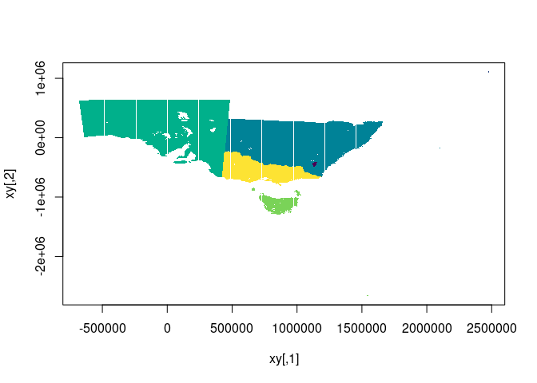

<!-- README.md is generated from README.Rmd. Please edit that file -->

# laserize

<!-- badges: start -->

[](https://github.com/hypertidy/laserize/actions/workflows/R-CMD-check.yaml)
<!-- badges: end -->

The goal of laserize is to rasterize without materializing any pixel
values.

This is an expression of my “cell abstraction”
[fasterize/issues/11](https://github.com/ecohealthalliance/fasterize/issues/11).

- [x] copy logic from fasterize, and remove Armadillo array handling
- [x] remove use of raster objects, in favour of input extent and
  dimension
- [x] remove all trace of the raster package
- [x] implement return of the ‘yline, xpix’ and polygon ID info to user
  (see below)
- [x] make return of ylin,xpix structure efficient (CollectorList.h ftw)
- [ ] move to cpp11
- [ ] rasterize lines and points
  [fasterize/issues/30](https://github.com/ecohealthalliance/fasterize/issues/30)
- [ ] consider formats other than sf (wk, geos, grd, rct, triangles
  etc.)
- [ ] provide output options (see next)
- [ ] name the package

## Outputs

Currently we get a list of triplets, so examples are unlist this to a
3-column matrix (and add 1).

- two options, record presence of polygon OR ID of polygon
- a row-indexed (*yline*) set of edge instances (start, end *xpix*)
  along scanlines with the two options
- tools to format this meaningfully, and plot lazily (see example for
  quick plot)
- tools to materialize as actual raster data

For the record, I wanted this facility before I read this issue - but
here’s a real world example, discussed in PROJ for very fast lookup for
large non-materialized (highly compressed) grids by Thomas Knudsen:

<https://github.com/OSGeo/PROJ/issues/1461#issuecomment-491501992>

## Installation

You can install the development version of laserize like so:

``` r
remotes::install_github("hypertidy/laserize")
```

## Example

This is a basic example, this is fast, and shows that it works. See the
todo list above.

``` r
pols <- silicate::inlandwaters

## define a raster (xmin, xmax, ymin, ymax), (ncol, nrow)
ext <- unlist(lapply(silicate::sc_vertex(pols), range))
dm <- c(500, 400)
r <- laserize:::laserize(pols, extent = ext,
                               dimension = dm)

## our index is triplets of start,end,line where the polygon edge was detected - 
## this essentially an rle by scanline of start,end polygon coverage
index <- matrix(unlist(r, use.names = F), ncol = 3L, byrow = TRUE) + 1 ## plus one because 0-index internally

str(index)
#>  num [1:779, 1:3] 291 288 286 286 286 286 290 286 287 287 ...

## convert to cells
cells <- vaster::cell_from_row_col(dm,  index[,c(3, 3)], index[,1:2])
str(cells)
#>  num [1:1558] 80291 80788 81286 81786 82286 ...
```

It scales to very large tasks, less than a second for `250000x200000`
dimension above, with 35Mb in memory output.

The following is inefficient, but shows that we get the right result.

``` r
plot(vaster::xy_from_cell(dm, ext, cells))
## now go inefficient, this is every column,row index, then converted to cell, converted to xy
cr <- do.call(rbind, apply(index, 1, \(.x) cbind(seq(.x[1], .x[2]), .x[3])))
points(xy <- vaster::xy_from_cell(dm, ext, vaster::cell_from_row_col(dm, cr[,2], cr[,1])), pch = ".", col = "darkgrey")
```



``` r

r <- terra::rast(cbind(xy, 0), type = "xyz")

r[terra::cellFromXY(r, xy)] <- 1
terra::plot(r ,col = "firebrick")
plot(silicate::SC0(pols), add = TRUE)
```


## Code of Conduct

Please note that the laserize project is released with a [Contributor
Code of
Conduct](https://contributor-covenant.org/version/2/1/CODE_OF_CONDUCT.html).
By contributing to this project, you agree to abide by its terms.
