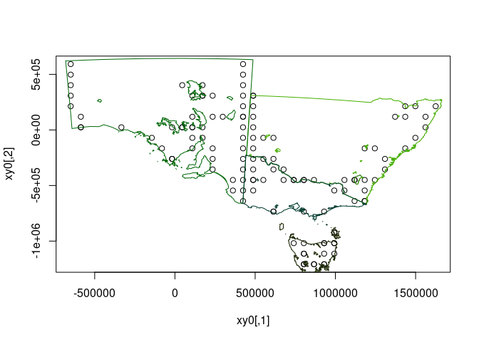
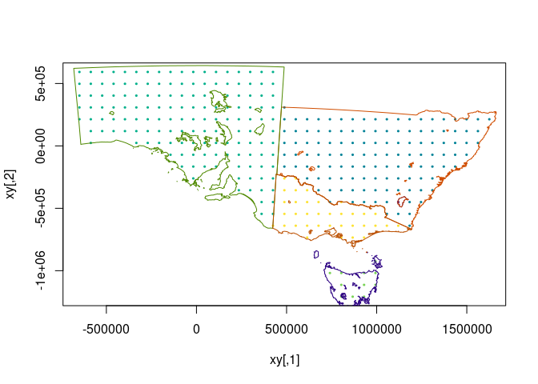

<!-- README.md is generated from README.Rmd. Please edit that file -->

# controlledburn

<!-- badges: start -->

[](https://github.com/hypertidy/controlledburn/actions/workflows/R-CMD-check.yaml)
<!-- badges: end -->

The goal of controlledburn is to rasterize without materializing any
pixel values.

This is an expression of the “cell abstraction” wish item
[fasterize/issues/11](https://github.com/ecohealthalliance/fasterize/issues/11).

- [ ] move to cpp11
- [ ] rasterize lines
  [fasterize/issues/30](https://github.com/ecohealthalliance/fasterize/issues/30)
- [ ] formats for import (wk, geos, grd, rct, triangles etc.)
- [ ] streaming with wkb/xy unpack with wk
- [ ] provide output options (see next section)
- [ ] port back into fasterize, with options for efficiently writing out
  to a tiled and sparse GeoTIF
- [x] points is too easy, see vaster::cell_from_xy
- [x] name the package
- [x] copy logic from fasterize, and remove Armadillo array handling
- [x] remove use of raster objects, in favour of input extent and
  dimension
- [x] remove all trace of the raster package
- [x] implement return of the ‘yline, xpix’ and polygon ID info to user
  (see below)
- [x] make return of ylin,xpix structure efficient (CollectorList.h ftw)

Lines is built-in but still has some problems. For polygons it’s pretty
good, see [fasterize
\#6](https://github.com/ecohealthalliance/fasterize/issues/6) for a
remaining issue.

## Outputs

Currently we get a list of triplets, so examples are this to a 3-column
matrix (and add 1).

- two options, record presence of polygon OR ID of polygon
- a row-indexed (*yline*) set of edge instances (start, end *xpix*)
  along scanlines with the two options
- tools to format this meaningfully, and plot lazily (see example for
  quick plot)
- tools to materialize as actual raster data

I wanted this facility a long time, and tried to get discussion on it
and tried to implement it. I also found this real world example,
discussed in PROJ for very fast lookup for large non-materialized
(highly compressed) grids by Thomas Knudsen:

<https://github.com/OSGeo/PROJ/issues/1461#issuecomment-491501992>

## Installation

You can install the development version of controlledburn like so:

``` r
remotes::install_github("hypertidy/controlledburn")
```

## Example

This is a basic example, this is fast, and shows that it works. See the
todo list above.

``` r
pols <- silicate::inlandwaters
library(vaster)
#> 
#> Attaching package: 'vaster'
#> The following object is masked from 'package:stats':
#> 
#>     ts
## define a raster (xmin, xmax, ymin, ymax), (ncol, nrow)
ext <- unlist(lapply(silicate::sc_vertex(pols), range))
dm <- c(50, 40)
r <- controlledburn:::burn_polygon(pols, extent = ext,
                               dimension = dm)

## our index is triplets of start,end,line where the polygon edge was detected - 
## this essentially an rle by scanline of start,end polygon coverage
index <- matrix(unlist(r, use.names = F), ncol = 3L, byrow = TRUE) + 1 ## plus one because 0-index internally

## plot just the start and ends of each scanline detected
xy0 <- vaster::xy_from_cell(dm, ext, vaster::cell_from_row_col(dm, index[,c(3, 3)], index[,1:2]))
plot(xy0)
plot(silicate::PATH0(pols), add = TRUE)
```



``` r

## expand out to every cell
cr <- do.call(rbind, apply(index, 1, \(.x) cbind(seq(.x[1], .x[2]), .x[3])))
xy <- vaster::xy_from_cell(dm, ext, vaster::cell_from_row_col(dm, cr[,2], cr[,1]))
plot(xy, pch = 19, cex = .3)
plot(silicate::PATH0(pols), add = TRUE)
```



It scales to very large tasks, with small output.

``` r
dm <- c(500000, 400000)
system.time(r <- controlledburn:::burn_polygon(pols, extent = ext,
                               dimension = dm))
#>    user  system elapsed 
#>   1.019   0.032   1.052
length(r)
#> [1] 989153

## consider a prod(dm) raster of type double (or even bool) obviously would compress again but why churn
pryr::object_size(r)  
#> 71.22 MB
```

The following is inefficient, but shows that we get the right result.

``` r
dm <- c(500, 400)
system.time(r <- controlledburn:::burn_polygon(pols, extent = ext,
                               dimension = dm))
#>    user  system elapsed 
#>   0.002   0.000   0.002

index <- matrix(unlist(r, use.names = F), ncol = 3L, byrow = TRUE) + 1 ## plus one because 0-index internally

## now go inefficient, this is every column,row index, then converted to cell, converted to xy
cr <- do.call(rbind, apply(index, 1, \(.x) cbind(seq(.x[1], .x[2]), .x[3])))
xy <- vaster::xy_from_cell(dm, ext, vaster::cell_from_row_col(dm, cr[,2], cr[,1]))
plot(xy, pch = ".", col = "darkgrey")
```


``` r

rr <- terra::rast(cbind(xy, 0), type = "xyz")

rr[terra::cellFromXY(rr, xy)] <- 1
terra::plot(rr ,col = "firebrick", asp = NA)
plot(silicate::SC0(pols), add = TRUE)
```


## Code of Conduct

Please note that the controlledburn project is released with a
[Contributor Code of
Conduct](https://contributor-covenant.org/version/2/1/CODE_OF_CONDUCT.html).
By contributing to this project, you agree to abide by its terms.
